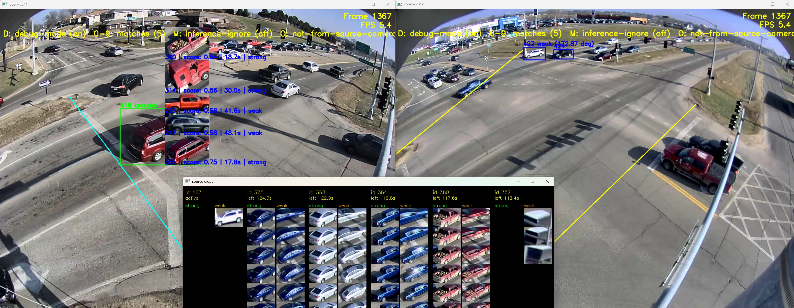

# Cars Multicamera Matching

Re-Identifies vehicles in a traffic camera that were previously visible in another traffic camera.

There's a **source** camera and a **query** camera. Cars that leave the source camera are recorded into a 
temporary source gallery. Query-camera cars are compared against that gallery after crossing the 
query entry line (red line).
The following videos show mainly query camera, source camera is shown in the yellow rectangle at the top left. 

  
Click [here](https://youtu.be/3h7nIVx7mr8) to see a longer and larger version on YouTube:


# Algorithm

1. **Detection and tracking**
   - Each camera frame on both cameras is masked so YOLO only sees the relevant road area (in debug mode, click M to see the masks)
   - A custom YOLO car detector runs on both cameras.
   - BotSort keeps stable per-camera track IDs for detected vehicles.

2. **Source-camera gallery creation**
   - The source camera is treated as the camera where vehicles should appear first.
   - While a source-camera track is visible, the system saves cropped vehicle images.
   - Crops are marked as **strong** when the vehicle is large enough, not overlapping another car, and moving in the expected direction. Other usable crops are kept as weak fallback crops.
   - If a source track crosses one of the configured discard lines (yellow lines), it is removed because it is moving toward an irrelevant exit.
   - When a source track disappears, the saved crops are converted into vehicle ReID embeddings and averaged into one gallery embedding for that source track.
   - Source records expire after `source_record_ttl_seconds` so old vehicles are not matched indefinitely.

3. **Query-camera candidate filtering**
   - Query-camera tracks are ignored if they appear in an area marked as not coming from the source camera (in debug mode, click O to see the mask)
   - For each remaining query track, the system stores ReID embeddings from its visible crops over time.
   - A query track becomes matchable after it crosses the configured query entry line.

4. **Cross-camera matching**
   - After a query track crosses the red entry line, its stored embeddings are averaged.
   - The averaged query embedding is compared with the source gallery using cosine similarity.
   - Matches are only considered if enough travel time has passed between the source track leaving and the query track crossing the entry line.
   - Weak source crops are penalized, and matches below the embedding-score threshold are treated as no match.


# Debug Mode
The debug mode displays both camera feeds separately. For the query camera, it shows the best source candidates, embedding scores, elapsed time, 
and whether the selected source crop was classified as strong or weak.  

You can also click on individual vehicles to isolate and inspect their displays.  
With M and O you can display the masks for ignoring the YOLO inference (shown in red) and in the query camera the area that defines vehicles that didn't come from the source camera. 
In addition, a separate window shows the current gallery of recorded crops from the source camera.  
  


# Performance
- A simple manual count resulted in **20 true positives** and **6 false positives** from frame 1000 to the end of the video.
This is a relatively short evaluation range, and additional testing is required to make the algorithm more robust. 
However, the analysis was limited by the length of the video.
- The speed usually varies between 8 FPS and 13 FPS using a GeForce RTX 4090. 
This is mostly acceptable because the input videos run at 10 FPS, but it can still skip frames during real-time use. 
Potential fixes include converting part of the matching code from Python to C++ or distributing source-camera 
embedding inference more efficiently over frames.


# Difficulties
- Embeddings get very noisy, especially on cars that are recorded from a different angle 
- Occlusions and overlapping vehicles can produce poor crops, so the source gallery needs to distinguish strong crops from weak fallback crops. 
It also amplifies embeddings from weak crops so they can compete with the strong crops. 

# Known Issues  
- Vehicles that were not visible in the source camera are often not classified as unknown when they appear in the query camera.
There is an embedding-score threshold below which detections are classified as unknown. However, raising this threshold too much would cause many valid matches to be discarded.
- YOLO was trained on images extracted from these videos. To improve its performance across a wider range of scenarios, additional training data is required.

# Yolo
For creating the model, Ultralytics and Label-Studio was used. For a better data-handling (pre-train, quality check, etc),
I created a separate tool:  
https://github.com/ThomasBittner1/DataManager


# Ideas to improve
- Tune the YOLO model 
- Batch or parallelize embedding inference for better real-time performance.
- Fine-tune embeddings model to get better embedding scores 
- Distribute source-camera embedding inference more efficiently to get a better FPS rate


## Install

**1. Install Python packages**
```powershell
pip install -r requirements.txt
```
**2. Patch fix the boxmot package**  
``` powershell
python _install_fix_boxmot.py
```


**3. Download Embedding Model files**  
  - `net_19.pth`
  - `opts.yaml`  

https://drive.google.com/file/d/1STbsacssLtlHpUesNzuTeUPrfMlWbSKu/view  
(Source: https://github.com/regob/vehicle_mtmc)  
After downloading the file, put *net_19.pth* and *opts.yaml* into the root folder.

**4. Download input videos**  
https://www.aicitychallenge.org/2022-track1-download
Put the main folder **AICity22_Track1_MTMC_Tracking** into the root folder of this project.


## Run

```powershell
python run.py
```

## Controls
- `d`: toggle debug mode
- `q`: quit
- `Space`: pause/resume
- Right arrow while paused: step one frame
- Mouse click a car: isolate that track in the clicked camera; click empty space to clear

Debug-only controls:

- `0`-`9`: number of match candidates to display
- `M`: toggle inference-ignore mask overlay
- `O`: toggle query not-from-source mask overlay
- `,` / `.`: page through source crop gallery


## Use of AI

AI-assisted development tools (primarily Codex) were used throughout the project to accelerate implementation, 
refactoring, and boilerplate generation.

Core algorithmic design, system integration, and debugging were performed mostly manually. 
Some utility modules, geometry helpers, and visualization code were heavily AI-assisted and subsequently reviewed/modified.
